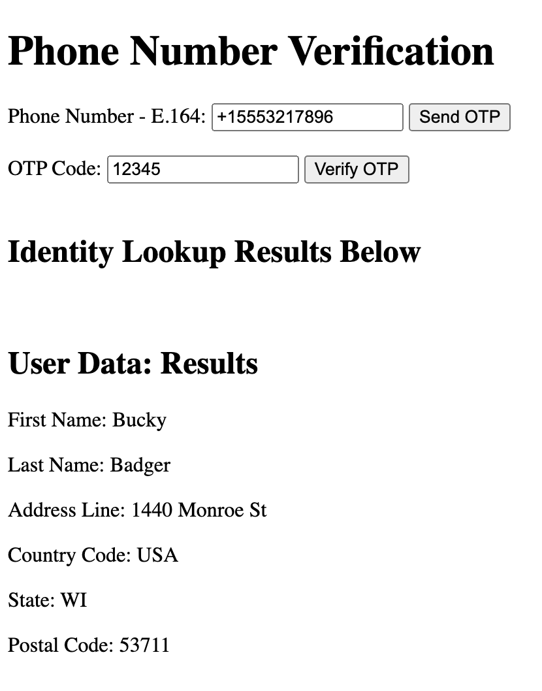

# Twilio Verify: Identity-Prefill-API Demo

Demo application showing Twilio Verify and Lookup Identity-Prefill APIs

This project demonstrates a phone number verification and prefilling user information using Twilio's Verify and Lookups APIs. Users can enter their phone number, receive an OTP, and verify their phone number. Upon successful verification, additional user details such as name and address will be fetched and displayed after a 90 seconds delay.

## Features

- Send OTP to entered phone number using Twilio Verify API.
- Verify OTP entered by the user.
- Fetch and display user information using Twilio Lookups API after successful OTP verification with a 90 seconds delay.

## Identity Prefill - User Data


## Prerequisites

- [Twilio Account](https://twilio.com/try-twilio)
- Twilio Verify and Lookups service credentials
- Twilio Functions enabled

## Getting Started

### Step 1: Clone the Repository

Clone the repository to your local machine:

```sh
git clone https://github.com/your-username/verify-prefill-demo.git
cd verify-prefill-demo
```

### Step 2: Set Up Twilio Functions

1. **Create a Twilio account** if you don’t already have one.
2. Navigate to the [Twilio Console](https://console.twilio.com/).

### Step 3: Create Verify Service

1. Navigate to the [Twilio Verify](https://www.twilio.com/verify) page.
2. Create a new Verify Service and note the `VERIFY_SERVICE_SID`.

### Step 4: Create Lookups API Key

1. Navigate to the [Twilio Console API Keys](https://www.twilio.com/console/project/api-keys).
2. Create a new API Key and note the `LOOKUP_API_KEY` & `LOOKUP_API_SECRET`.

### Step 5: Configure Twilio Functions

1. Go to the **Functions** section in the Twilio Console.
2. Click on **Create Service**, and name it `VerifyPrefillDemo`.
3. Create the following Functions within the service:

#### Function: `send-otp`

```javascript
exports.handler = async function(context, event, callback) {

  const phoneNumber = event.phoneNumber;
  const serviceSid = context.VERIFY_SERVICE_SID;

  const client = context.getTwilioClient();

  if (!serviceSid) {
    console.error('Missing VERIFY_SERVICE_SID');
    callback('Missing VERIFY_SERVICE_SID');
    return;
  }

  try {
    // Validate phone number using Twilio Lookup API with Node.js library

    const lookupResponse = await client.lookups.v2.phoneNumbers(phoneNumber).fetch();
    if (!lookupResponse.valid) {

      const message = 'Invalid phone number. Please enter a valid number in E.164 format.';
      console.error(message, lookupResponse);
      return callback(null, { success: false, message });
    }

    // Start verification if the phone number is valid
    const verification = await client.verify.v2.services(serviceSid)
      .verifications
      .create({ to: phoneNumber, channel: 'sms' });

    console.log('Verification response:', verification);

    callback(null, { success: true, message: `Verification sent to ${phoneNumber}` });
  } catch (error) {
    console.error('Error sending OTP:', error);
    callback(null, { success: false, message: error.message });
  }
};
```

#### Function: `verify-otp`

```javascript
exports.handler = async function(context, event, callback) {
  const phoneNumber = event.phoneNumber;
  const code = event.code;
  const serviceSid = context.VERIFY_SERVICE_SID;

  const client = context.getTwilioClient();

  if (!serviceSid) {
    console.error('Missing VERIFY_SERVICE_SID');
    callback('Missing VERIFY_SERVICE_SID');
    return;
  }

  try {
    // Verify the OTP using Twilio Verify API V2
    const verificationCheck = await client.verify.v2.services(serviceSid)
      .verificationChecks
      .create({ to: phoneNumber, code: code });

    console.log('Verification check response:', verificationCheck);

    if (verificationCheck.status === 'approved') {
      callback(null, { success: true, verificationSid: verificationCheck.sid });
    } else {
      callback(null, { success: false, message: 'Verification failed. Status: ' + verificationCheck.status });
    }
  } catch (error) {
    console.error('Error verifying OTP:', error);
    callback(null, { success: false, message: error.message });
  }
};
```

#### Function: `fetch-user-data`

```javascript
exports.handler = async function(context, event, callback) {
  const phoneNumber = event.phoneNumber;
  const verificationSid = event.verificationSid;
  const lookupApiKey = context.LOOKUP_API_KEY;
  const lookupApiSecret = context.LOOKUP_API_SECRET;

  try {
    // Use dynamic import to load the node-fetch module
    const fetch = (await import('node-fetch')).default;

    const lookupUrl = `https://lookups.twilio.com/v2/PhoneNumbers/${phoneNumber}?Fields=pre_fill&VerificationSid=${verificationSid}`;
    const lookupResponse = await fetch(lookupUrl, {
      headers: {
        'Authorization': `Basic ${Buffer.from(`${lookupApiKey}:${lookupApiSecret}`).toString('base64')}`
      }
    });

    const lookupData = await lookupResponse.json();

    return callback(null, { success: true, prefillData: lookupData.pre_fill });
  } catch (error) {
    console.error('Error fetching user data:', error);
    return callback(null, { success: false, message: error.message });
  }
};
```

### Step 6: Configure Environment Variables & Dependencies

Go to the **Environment Variables** section in your Twilio Functions and add the following:

- `VERIFY_SERVICE_SID` = Your Verify Service SID
- `LOOKUP_API_KEY` = Your Lookup API Key
- `LOOKUP_API_SECRET` = Your Lookup API Secret

Go to the **Dependencies** section in your Twilio Functions and add the following:

- `node-fetch` : Version 3.3.2
- `twilio` : Version 5.0.4

### Step 7: Upload HTML Asset

Upload the `index.html` file to the **Assets** section in your Twilio Functions. Use the following content for `index.html`:

```html
<!DOCTYPE html>
<html lang="en">
<head>
  <meta charset="UTF-8">
  <meta name="viewport" content="width=device-width, initial-scale=1.0">
  <title>Verify Prefill Demo</title>
</head>
<body>
  <h1>Phone Number Verification</h1>
  <form id="verification-form">
    <label for="phone-number">Phone Number - E.164:</label>
    <input type="tel" id="phone-number" name="phone-number" required>
    <button type="button" onclick="sendOTP()">Send OTP</button>
    <br><br>
    <label for="otp-code">OTP Code:</label>
    <input type="text" id="otp-code" name="otp-code" required>
    <button type="button" onclick="verifyOTP()">Verify OTP</button>
  </form>
  <br>
  <h2>Identity Lookup Results Below</h2>
  <br>
  <div id="user-data" style="display:none;">
    <h2>User Data: Results</h2>
    <p>First Name: <span id="first-name"></span></p>
    <p>Last Name: <span id="last-name"></span></p>
    <p>Address Line: <span id="address-line"></span></p>
    <p>Country Code: <span id="country-code"></span></p>
    <p>State: <span id="state"></span></p>
    <p>Postal Code: <span id="postal-code"></span></p>
  </div>

  <script>
    async function sendOTP() {
      const phoneNumber = document.getElementById('phone-number').value;
      const response = await fetch('/send-otp', {
        method: 'POST',
        headers: {
          'Content-Type': 'application/json',
        },
        body: JSON.stringify({ phoneNumber })
      });
      const result = await response.json();
      alert(result.message);
    }

    async function verifyOTP() {
      const phoneNumber = document.getElementById('phone-number').value;
      const code = document.getElementById('otp-code').value;
      const response = await fetch('/verify-otp', {
        method: 'POST',
        headers: {
          'Content-Type': 'application/json',
        },
        body: JSON.stringify({ phoneNumber, code })
      });
      const result = await response.json();
      if (result.success) {
        alert('Verification successful. Fetching user data in 90 seconds...');
        setTimeout(() => fetchUserData(phoneNumber, result.verificationSid), 90000); // 90 seconds delay
      } else {
        alert('Verification failed: ' + result.message);
      }
    }

    async function fetchUserData(phoneNumber, verificationSid) {
      const response = await fetch('/fetch-user-data', {
        method: 'POST',
        headers: {
          'Content-Type': 'application/json',
        },
        body: JSON.stringify({ phoneNumber, verificationSid })
      });
      const result = await response.json();
      if (result.success) {
        displayUserData(result.prefillData);
      } else {
        alert('Fetching user data failed: ' + result.message);
      }
    }

    function displayUserData(data) {
      document.getElementById('first-name').innerText = data.first_name;
      document.getElementById('last-name').innerText = data.last_name;
      document.getElementById('address-line').innerText = data.address_line;
      document.getElementById('country-code').innerText = data.country_code;
      document.getElementById('state').innerText = data.state;
      document.getElementById('postal-code').innerText = data.postal_code;
      document.getElementById('user-data').style.display = 'block';
    }
  </script>
</body>
</html>
```

### Step 8: Test the Application

1. Access your Twilio Function URL that serves the `index.html` file.
2. Enter a phone number and click on "Send OTP."
3. Enter the received OTP and click on "Verify OTP."
4. Upon successful verification, wait for 90 seconds, and then user data should be displayed on the webpage.

## License

This project is licensed under the MIT License - see the [LICENSE](LICENSE) file for details.

