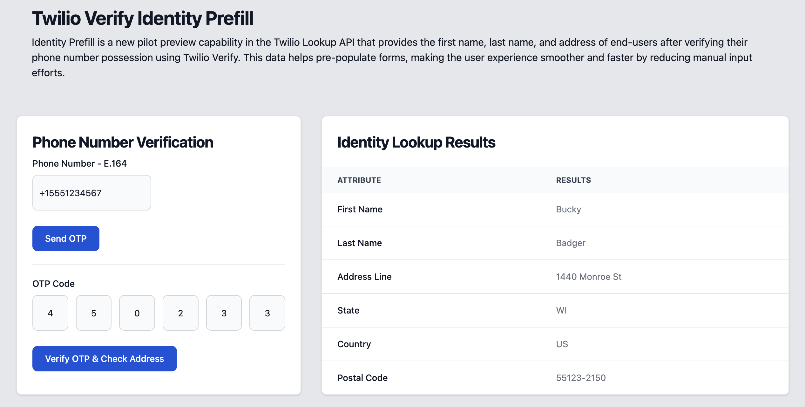

# Twilio Verify: Identity-Prefill-API Demo

Demo application showing Twilio Verify and Lookup Identity-Prefill APIs

In today's digital age, user experience is paramount. Every additional step or friction point can deter potential customers, reduce conversion rates, and degrade the overall experience. To combat this, Twilio introduces an innovative feature within its Lookup API: **Identity Pre-Fill** in Private Beta. This powerful tool can revolutionize how businesses handle customer interactions, from onboarding to checkout, by pre-populating user data with verified information. Below, we discuss how this feature works, its potential benefits, and ways you can leverage it through a sample demo app.

This project demonstrates a phone number verification and prefilling user information using Twilio's Verify and Lookups APIs. Users can enter their phone number, receive an OTP, and verify their phone number. Upon successful verification, additional user details such as name and address will be fetched and displayed after a 90 seconds delay.

## Features

- Send OTP to entered phone number using Twilio Verify API.
- Verify OTP entered by the user.
- Fetch and display user information using Twilio Lookups API after successful OTP verification with a 90 seconds delay.

## Identity Prefill - User Data



### What is Identity Pre-Fill?


**Identity Pre-Fill** is a new pilot preview capability in the Twilio Lookup API that provides the first name, last name, and address of end-users after verifying their phone number possession using Twilio Verify. This data helps pre-populate forms, making the user experience smoother and faster by reducing manual input efforts.


#### Value Propositions


1. **Frictionless Customer Onboarding**:

   - **Scenario**: During onboarding, reducing user effort is crucial. During your onboarding process, start by requesting the consumer phone number. Using Twilio Verify, verify the number, and once verified, supply the Verification SID to the Lookup Pre-Fill API. In return, get the user’s first name, last name, and address.

   - **Benefit**: This reduces friction and speeds up the onboarding process, enhancing the user experience. Auto-populating user data (name and address) reduces friction and increases conversion rates.


2. **Streamline Customer Checkout**:

   - **Scenario**: During checkout, customers provide a phone number that's verified via Twilio Verify. Once the verification is approved, use Prefill to populate the name and address fields instantly.  Around 70% of shoppers abandon carts, with even higher rates on mobile.

   - **Benefit**: This quickens the checkout process, reducing cart abandonment rates.  With a verified phone number, you can auto-populate the name and shipping/billing address, which can lead to higher checkout conversion rates.


3. **Reduce Time and Effort**:

   - **Scenario**: Filling out forms often feels burdensome to users. With Identity Pre-Fill, forms auto-populate with the verified user's details.

   - **Benefit**: Less perceived effort and time to fill out forms, leading to a smooth user interaction.


4. **Avoid Misspellings**:

   - **Scenario**: Manually entering information can lead to errors.

   - **Benefit**: Automatically filled forms ensure accuracy in user details, reducing errors like misspellings of names or addresses.


5. **Increase Conversion Rate**:

   - **Scenario**: Reducing the number of steps in any process lowers interaction costs.

   - **Benefit**: A smoother user experience leads to higher conversion rates because users can navigate through forms easily.


## Prerequisites

- [Twilio Account](https://twilio.com/try-twilio)
- Twilio Verify and Lookups service credentials
- Twilio Functions enabled


## Getting Started

### Step 1: Clone the Repository

Clone the repository to your local machine:

```sh
git clone https://github.com/your-username/verify-prefill-demo.git
cd verify-prefill-demo
```

### Step 2: Set Up Twilio Functions

1. **Create a Twilio account** if you don’t already have one.
2. Navigate to the [Twilio Console](https://console.twilio.com/).

### Step 3: Create Verify Service

1. Navigate to the [Twilio Verify](https://www.twilio.com/verify) page.
2. Create a new Verify Service and note the `VERIFY_SERVICE_SID`.

### Step 4: Create Lookups API Key

1. Navigate to the [Twilio Console API Keys](https://www.twilio.com/console/project/api-keys).
2. Create a new API Key and note the `LOOKUP_API_KEY` & `LOOKUP_API_SECRET`.

### Step 5: Configure Twilio Functions

1. Go to the **Functions** section in the Twilio Console.
2. Click on **Create Service**, and name it `VerifyPrefillDemo`.
3. Create the following Functions within the service:

#### Function: `send-otp`

```javascript
exports.handler = async function(context, event, callback) {
  const { phoneNumber } = event;
  const { VERIFY_SERVICE_SID: serviceSid } = context;

  // Ensure the Twilio client is initialized
  const client = context.getTwilioClient();

  if (!serviceSid) {
    console.error('Missing VERIFY_SERVICE_SID');
    return callback('Missing VERIFY_SERVICE_SID');
  }

  try {
    // Validate phone number using Twilio Lookup API with Node.js library
    const lookupResponse = await client.lookups.v2.phoneNumbers(phoneNumber).fetch();

    if (!lookupResponse.valid) {
      const message = 'Invalid phone number. Please enter a valid number in E.164 format.';
      console.error(message, lookupResponse);
      return callback(null, { success: false, message });
    }

    // Start verification if the phone number is valid
    const verification = await client.verify.v2.services(serviceSid)
      .verifications
      .create({ to: phoneNumber, channel: 'sms' });

    console.log('Verification response:', verification);

    return callback(null, { success: true, message: `Verification sent to ${phoneNumber}` });
  } catch (error) {
    console.error('Error sending OTP:', error);
    return callback(null, { success: false, message: error.message });
  }
};
```

#### Function: `verify-otp`

```javascript
exports.handler = async function(context, event, callback) {
  const { phoneNumber, code } = event;
  const { VERIFY_SERVICE_SID: serviceSid } = context;

  const client = context.getTwilioClient();

  if (!serviceSid) {
    console.error('Missing VERIFY_SERVICE_SID');
    return callback('Missing VERIFY_SERVICE_SID');
  }

  try {
    // Verify the OTP using Twilio Verify API V2
    const verificationCheck = await client.verify.v2.services(serviceSid)
      .verificationChecks
      .create({ to: phoneNumber, code });

    console.log('Verification check response:', verificationCheck);

    if (verificationCheck.status === 'approved') {
      return callback(null, { success: true, verificationSid: verificationCheck.sid });
    } 
      return callback(null, { success: false, message: `Verification failed. Status: ${verificationCheck.status}` });
    
  } catch (error) {
    console.error('Error verifying OTP:', error);
    return callback(null, { success: false, message: error.message });
  }
};
```

#### Function: `fetch-user-data`

```javascript
exports.handler = async function (context, event, callback) {
  const {phoneNumber} = event;
  const {verificationSid} = event;
  const lookupApiKey = context.LOOKUP_API_KEY;
  const lookupApiSecret = context.LOOKUP_API_SECRET;

  try {
    // Use dynamic import to load the node-fetch module
    const fetch = (await import('node-fetch')).default;

    const lookupUrl = `https://lookups.twilio.com/v2/PhoneNumbers/${phoneNumber}?Fields=pre_fill&VerificationSid=${verificationSid}`;
    const lookupResponse = await fetch(lookupUrl, {
      headers: {
        Authorization: `Basic ${Buffer.from(
          `${lookupApiKey}:${lookupApiSecret}`
        ).toString('base64')}`,
      },
    });

    const lookupData = await lookupResponse.json();

    return callback(null, { success: true, prefillData: lookupData.pre_fill });
  } catch (error) {
    console.error('Error fetching user data:', error);
    return callback(null, { success: false, message: error.message });
  }
};
```

### Step 6: Configure Environment Variables & Dependencies

Go to the **Environment Variables** section in your Twilio Functions and add the following:

| Variable             | Description | Required |
| :------------------- | :---------- | :------- |
| `VERIFY_SERVICE_SID` | Verify SID  | True     |
| `LOOKUP_API_KEY`     | ApiKey      | True     |
| `LOOKUP_API_SECRET`  | ApiSecret   | True     |


Go to the **Dependencies** section in your Twilio Functions and add the following:

| Package      | Version | 
| :----------- | :------ |
| `node-fetch` | 3.3.2   |
| `twilio`     | 5.0.4   |


### Step 7: Upload HTML Asset

Upload the `index.html` file to the **Assets** section in your Twilio Functions. Use the following content for `index.html`:

```html
<!DOCTYPE html>
<html lang="en">
<head>
  <meta charset="UTF-8">
  <meta name="viewport" content="width=device-width, initial-scale=1.0">
  <title>Verify Prefill Demo</title>
</head>
<body>
  <h1>Phone Number Verification</h1>
  <form id="verification-form">
    <label for="phone-number">Phone Number - E.164:</label>
    <input type="tel" id="phone-number" name="phone-number" required>
    <button type="button" onclick="sendOTP()">Send OTP</button>
    <br><br>
    <label for="otp-code">OTP Code:</label>
    <input type="text" id="otp-code" name="otp-code" required>
    <button type="button" onclick="verifyOTP()">Verify OTP</button>
  </form>
  <br>
  <h2>Identity Lookup Results Below</h2>
  <br>
  <div id="user-data" style="display:none;">
    <h2>User Data: Results</h2>
    <p>First Name: <span id="first-name"></span></p>
    <p>Last Name: <span id="last-name"></span></p>
    <p>Address Line: <span id="address-line"></span></p>
    <p>Country Code: <span id="country-code"></span></p>
    <p>State: <span id="state"></span></p>
    <p>Postal Code: <span id="postal-code"></span></p>
  </div>

  <script>
    async function sendOTP() {
      const phoneNumber = document.getElementById('phone-number').value;
      const response = await fetch('/send-otp', {
        method: 'POST',
        headers: {
          'Content-Type': 'application/json',
        },
        body: JSON.stringify({ phoneNumber })
      });
      const result = await response.json();
      alert(result.message);
    }

    async function verifyOTP() {
      const phoneNumber = document.getElementById('phone-number').value;
      const code = document.getElementById('otp-code').value;
      const response = await fetch('/verify-otp', {
        method: 'POST',
        headers: {
          'Content-Type': 'application/json',
        },
        body: JSON.stringify({ phoneNumber, code })
      });
      const result = await response.json();
      if (result.success) {
        alert('Verification successful. Fetching user data in 90 seconds...');
        setTimeout(() => fetchUserData(phoneNumber, result.verificationSid), 90000); // 90 seconds delay
      } else {
        alert('Verification failed: ' + result.message);
      }
    }

    async function fetchUserData(phoneNumber, verificationSid) {
      const response = await fetch('/fetch-user-data', {
        method: 'POST',
        headers: {
          'Content-Type': 'application/json',
        },
        body: JSON.stringify({ phoneNumber, verificationSid })
      });
      const result = await response.json();
      if (result.success) {
        displayUserData(result.prefillData);
      } else {
        alert('Fetching user data failed: ' + result.message);
      }
    }

    function displayUserData(data) {
      document.getElementById('first-name').innerText = data.first_name;
      document.getElementById('last-name').innerText = data.last_name;
      document.getElementById('address-line').innerText = data.address_line;
      document.getElementById('country-code').innerText = data.country_code;
      document.getElementById('state').innerText = data.state;
      document.getElementById('postal-code').innerText = data.postal_code;
      document.getElementById('user-data').style.display = 'block';
    }
  </script>
</body>
</html>
```

### Step 8: Test the Application

1. Access your Twilio Function URL that serves the `index.html` file.
2. Enter a phone number and click on "Send OTP."
3. Enter the received OTP and click on "Verify OTP."
4. Upon successful verification, wait for 90 seconds, and then user data should be displayed on the webpage.


### Technical Details


A few technical aspects to keep in mind:

- Queries to the Identity Pre-Fill API are only accepted within 10 minutes of successful verification through Twilio Verify.

- This product is only available in the United States during the pilot phase.

- Use of this product requires the use of the Twilio Verify product. Customers using custom code implementations for verification are not eligible for the pilot.


### Conclusion


Identity Pre-Fill is a game-changer for businesses looking to enhance user experiences and streamline processes. By reducing the effort required to fill out forms and ensuring data accuracy while speeding up interactions, you can significantly improve customer satisfaction and conversion rates.


#### Learn More

For detailed documentation and more information on Identity Pre-Fill, visit the [Twilio Lookup API documentation](https://www.twilio.com/docs/lookup/api).


## License

This project is licensed under the MIT License - see the [LICENSE](LICENSE) file for details.

